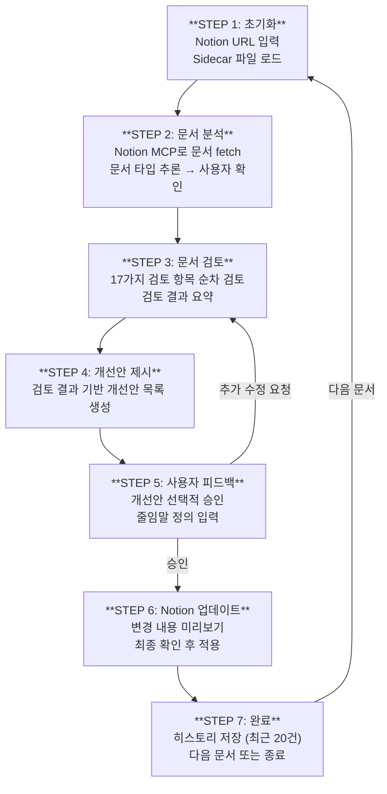

# 📋 core-platform-notion-reviewer

Core Platform Team이 Notion에 작성한 문서를 **일관된 품질 기준**으로 리뷰하고, 승인 시 **자동으로 개선**하는 워크플로우입니다.

---

## 🎯 목적

- Notion에 작성된 다양한 문서(테크스펙, 시스템 기획, 업무 티켓 등)의 **가독성**과 **일관성** 향상
- 문서 타입별 **맞춤형 검토 기준** 적용
- 사용자 승인 후 **Notion MCP를 통해 자동 수정**

---

## 📄 지원 문서 타입

| 타입 | 설명 | 데이터 소스 |
|------|------|------------|
| **테크스펙** | 기술 명세 문서 | Note DB |
| **시스템 소개/기획** | 시스템 설명 및 기획 문서 | Note DB |
| **시스템 설계** | 아키텍처/설계 문서 | Note DB |
| **업무 단위 티켓** | 작업 단위 (Task/Issue) | Action Item DB |
| **아이데이션/브레인스토밍** | 자유 형식 아이디어 문서 | Note DB |

---

## 📚 문서 리뷰 핵심 철학

모든 리뷰는 아래 3가지 핵심 철학을 기반으로 수행됩니다.

| 철학 | 핵심 질문 | 설명 |
|------|----------|------|
| **Write to Read** | "읽는 사람이 편한가?" | 쓰는 사람이 편한 글이 아니라, **읽는 사람이 편한 글**을 쓴다. |
| **Focus on "Why" & "Decision"** | "왜 이 결정을 했는가?" | 단순 사실 나열보다 **결정의 이유**와 **Trade-off**가 핵심이다. |
| **Living Document** | "현재 상태를 반영하는가?" | 문서는 **코드가 배포될 때 함께 업데이트**되어야 한다. (Stale 문서 지양) |

---

## 📄 문서 타입별 권장 구조

각 문서 타입별로 권장되는 구조와 핵심 포인트입니다.

| 문서 타입 | 목적 | 핵심 섹션 |
|----------|------|----------|
| **테크스펙** | 코드 작성 전 구현 세부사항 정의 | Overview, **Implementation Details** (ERD/API/Flowchart), Impact & Risk, Testing Strategy |
| **시스템 소개/기획** | 프로젝트 설득 & 범위 확정 | Problem Statement (Why), Proposed Solution, Scope + **Non-Goals** ⭐ |
| **시스템 설계** | 아키텍처 & 기술 의사결정 근거 | Architecture (Diagram 필수), Key Decisions, **Alternatives Considered** ⭐⭐, Scalability, Security |
| **아이데이션/브레인스토밍** | 생각 정리 & 방향 설정 | Context, Brainstorming Notes, Pros & Cons, **Conclusion (Action Item)** ⭐ |
| **업무 단위 티켓** | 실무자의 명확한 인지 | Title (태그 포함), **Context (Why)** ⭐, **Acceptance Criteria** ⭐ |

> **⭐ 표시:** 해당 문서 타입에서 가장 중요한 섹션

---

## ✅ 검토 기능 목록 (17개 카테고리)

### 1. 필수 속성 검토
문서 타입별 필수 속성이 채워져 있는지 확인합니다.
- 예: `Project Name`, `Status`, `Date`, `Author` 등

### 2. Status 규칙 검토 (업무 티켓)
업무 티켓의 Status와 Date 간의 논리적 정합성을 검토합니다.

### 3. 본문 구조 검토
해당 문서 타입에 필수적인 섹션이 있는지 확인합니다.
- TL;DR은 **문서가 완성도 있게 갖춰진 경우에만** 추가 제안

### 4. 목차(TOC) 검토
- 읽는 데 **3분 이상** 걸리는 문서에 목차 필수
- ⚠️ TOC는 API로 추가 불가 → 수동 추가 안내 제공

### 5. 가독성 및 스타일 검토
- 긴 문단 분리, 불렛 포인트/서식 활용도
- Notion 네이티브 스타일(헤딩, 인용구, 콜아웃) 활용

### 6. 헤딩 구조 검토 (H1~H3)
| 문제 유형 | 설명 |
|----------|------|
| 헤딩 누락 | 긴 섹션에 헤딩 없이 나열 |
| 계층 건너뛰기 | H1 다음 바로 H3 사용 |
| 과도한 헤딩 | 짧은 내용에 불필요한 헤딩 |

### 7. 텍스트 강조 검토
| 강조 유형 | 용도 | 예시 |
|----------|------|------|
| **Bold** | 핵심 키워드 | **필수**, **API 엔드포인트** |
| *Italic* | 참고 사항, 용어 첫 등장 | *OAuth 2.0* |
| `Backtick` | 코드, 명령어, 기술 용어 | `GET /api/users` |

### 8. 이모지 사용량 검토
전체 텍스트 대비 **5% 초과 시** 개선을 제안합니다.

### 9. 논리적 전개 검토
| 항목 | 설명 |
|------|------|
| 제목-내용 일치도 | 제목이 본문 내용을 정확히 반영하는가 |
| 논리적 흐름 | 섹션 순서가 자연스러운가 |
| 용어/개념 일관성 | 동일 개념에 다른 용어를 혼용하지 않는가 |

### 10. 줄임말(약어) 검토
- 미정의 줄임말 감지 → 사용자에게 Full Description 입력 요청
- 인라인 정의 또는 Glossary 섹션 추가

**기술조직 공통 줄임말 (정의 불필요):**
> API, DB, SDK, IDE, UI, UX, URL, HTTP, REST, JSON, AWS, GCP, K8S, CI, CD, PR, MR, QA, SLA, KPI, ML, AI, LLM, MCP 등

### 11. 문장 품질 검토 (Draft용)
| 항목 | 예시 |
|------|------|
| **비문/문법 오류** | "데이터를 처리를 한다" → "데이터를 처리한다" |
| **어색한 표현** | "진행이 되어진다" → "진행된다" |
| **구어체→문어체** | "이거 해야됨" → "이 작업이 필요합니다" |
| **중복 문장 삭제** | 동일/유사 의미 문장 반복 시 삭제 |
| **짧은 문장 통합** | 문맥 연결 가능한 짧은 문장 통합 |

### 12. 톤 통일 (존댓말)
문서 전체의 어미를 **존댓말(`~입니다`, `~합니다`)** 로 통일합니다.

| 반말/평서형 | 존댓말 |
|------------|--------|
| ~한다 | ~합니다 |
| ~이다 | ~입니다 |
| ~임 / ~함 | ~입니다 / ~합니다 |

### 13. Context 보완 추천 (업무 티켓)
Context가 부족한 경우 동일 Project의 관련 문서를 추천합니다. (최대 3~5개)

### 14. 읽는 사람 중심 검토 (Write to Read)
배경 지식이 없는 동료도 이해할 수 있는 구조인지 검토합니다.
- 전문 용어 설명이 있는가?
- 결론/요약이 먼저 나오는가? (Top-down)
- 읽는 사람의 시간을 절약해주는 구조인가?

### 15. Why 누락 검토 (Focus on Decision)
결정이나 설계의 이유(Why)가 명시되어 있는지 확인합니다.
- "What"만 있고 "Why"가 없는 섹션이 있는가?
- 여러 대안 중 선택한 이유가 명시되어 있는가?

### 16. Trade-off 누락 검토 (시스템 설계)
대안이나 포기한 옵션에 대한 설명이 있는지 확인합니다.
- **Alternatives Considered** 섹션이 가장 중요
- "왜 A를 선택하고 B를 버렸는가?"

### 17. 문서 현재성 검토 (Living Document)
현재 시스템 상태와 맞지 않거나 업데이트가 필요한 내용이 있는지 확인합니다.
- "예정", "계획" 등 과거의 미래형 표현이 현재도 유효한가?
- 더 이상 사용하지 않는 시스템/기능에 대한 설명이 있는가?

---

## 🔄 워크플로우 흐름



### 단계별 요약

| 단계 | 설명 |
|------|------|
| **STEP 1** | Notion URL 입력, Sidecar 로드 |
| **STEP 2** | 문서 fetch, 타입 추론 및 확인 |
| **STEP 3** | 17가지 검토 항목 순차 검토 |
| **STEP 4** | 개선안 목록 생성 |
| **STEP 5** | 사용자 피드백, 줄임말 정의 입력 |
| **STEP 6** | 미리보기 후 Notion 업데이트 |
| **STEP 7** | 히스토리 저장, 완료 또는 반복 |

---

## 🚀 사용 방법

### 사전 요구사항
- Cursor IDE에 **Notion MCP**가 설정되어 있어야 합니다.
- Notion 워크스페이스에 대한 접근 권한이 필요합니다.

### 실행 방법

1. Cursor에서 `workflow.md` 파일을 엽니다.
2. 워크플로우를 시작합니다.
3. 검토할 Notion 문서의 URL을 입력합니다.
4. AI가 문서를 분석하고 타입을 추론합니다.
5. 검토 결과와 개선안을 확인합니다.
6. 원하는 개선안을 선택하여 승인합니다.
7. 변경 내용 미리보기를 확인하고 최종 승인합니다.
8. Notion 문서가 자동으로 업데이트됩니다.

---

## 🔧 사용 도구

| 도구 | 용도 |
|------|------|
| **Notion MCP** | 문서 조회, 수정, 검색 |
| **Sidecar File** | 세션 간 상태/히스토리 유지 |

---

## 📦 파일 구조

```
deployment/
├── README.md                # 이 파일
├── summary.md               # 요약본
├── workflow.md              # 메인 워크플로우 정의
├── data/
│   ├── document-types.csv   # 문서 타입 정의
│   └── review-criteria.csv  # 검토 기준 정의 (29개)
├── steps/
│   ├── step-01-init.md      # 초기화
│   ├── step-02-analyze.md   # 문서 분석
│   ├── step-03-review.md    # 문서 검토 (13개 카테고리)
│   ├── step-04-suggest.md   # 개선안 제시
│   ├── step-05-feedback.md  # 사용자 피드백
│   ├── step-06-apply.md     # Notion 업데이트
│   └── step-07-complete.md  # 완료
└── sidecar/                 # 히스토리 저장 (자동 생성)
```

---

## ⚠️ 주의사항

- **이미지, 임베드 등 미디어 블록**은 수정되지 않습니다.
- **Table of Contents(TOC)**는 API로 추가 불가 → 수동 추가 안내
- 워크플로우 실행 전 `workflow.md`의 `workflow_path`를 실제 경로로 수정해야 합니다.
- Sidecar 히스토리는 최근 **20건**만 유지됩니다.

---

## 📝 설치 후 설정

`workflow.md` 파일의 상단에서 `workflow_path`를 실제 배포 경로로 수정하세요:

```yaml
workflow_path: [실제 deployment 폴더 경로]
```

예시:
```yaml
workflow_path: /Users/username/project/.cursor/workflows/core-platform-notion-reviewer
```

---

## 📜 라이선스

이 워크플로우는 Core Platform Team 내부 사용을 위해 제작되었습니다.
